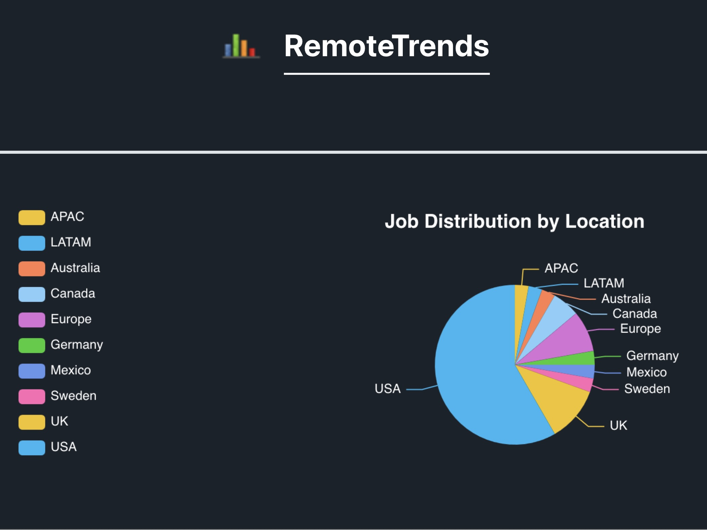

# RemoteTrends

## Project Overview

RemoteTrends is a web application designed to provide users with insights into remote job trends. The application leverages a third-party API to fetch real-time job data, allowing users to explore various job listings based on location and other criteria.

The project utilizes ECharts, a powerful charting library, to visualize the data in an interactive and user-friendly manner. With ECharts, users can easily interpret job distribution, trends, and other relevant statistics through visually appealing charts and graphs.

Key features of the application include:
- **Dynamic Data Fetching**: The application retrieves job data from an external API, ensuring that users have access to the latest information.
- **Interactive Visualizations**: ECharts is used to create responsive and interactive charts that help users understand job trends at a glance.
- **User-Friendly Interface**: The application is designed with a clean and intuitive interface, making it easy for users to navigate and find the information they need.

Overall, RemoteTrends aims to empower job seekers and employers by providing valuable insights into the remote job market.

## Screenshots



## Technologies Used

- ⚛️ React
- 🟡 JavaScript
- 🎨 Bootstrap

## How to Use

1. **Fork the Repository**: Click the "Fork" button at the top right of this repository to create your own copy.

2. **Clone Locally**: Clone the forked repository to your local machine using:
   ```bash
   git clone <your-forked-repo-url>
   ```

3. **Navigate to the Project Directory**: Change into the project directory:
   ```bash
   cd <project-directory>
   ```

4. **Install Dependencies**: Run the following command to install all necessary dependencies:
   ```bash
   npm install
   ```

5. **Start the Application**: Once the installation is complete, start the application with:
   ```bash
   npm run dev
   ```

6. **View in Browser**: Open your browser and go to your localhost to see your project running.

## Contact

Feel free to reach out via [email](mailto:danutnanu@icloud.com) or [LinkedIn](https://www.linkedin.com/in/danut-nanu-7474b4267/).
